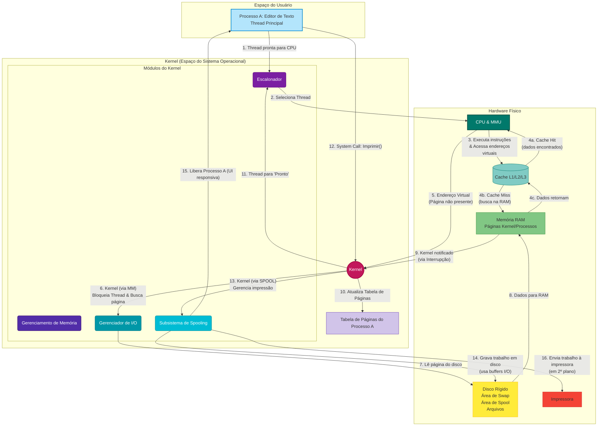

## Guia do Diagrama de Fluxo (Versão 2): Interações Verticais e Compactas

Este diagrama de fluxo, agora mais vertical e compacto, ilustra as interações entre os componentes do Sistema Operacional durante um cenário de uso, focando no "como" as coisas acontecem.

### Execução Normal (Passos 1-4)

1.  Uma **Thread** do **Processo A** (o editor de texto) está em estado de "pronto" e aguarda sua vez no **Escalonador**.
2.  O **Escalonador** (parte do **Kernel**) seleciona esta Thread, concedendo-lhe tempo de **CPU**.
3.  A **CPU** começa a executar as instruções da Thread e, para isso, precisa acessar dados e código.
4.  A **CPU** tenta buscar os dados primeiramente em sua **Cache** (L1, L2, L3). Se os dados estiverem na Cache (*Cache Hit*), são acessados rapidamente. Se não (*Cache Miss*), a **CPU** busca os dados na **RAM**, e esse bloco de dados é então copiado para a Cache para futuros acessos mais rápidos.

### Cenário de *Page Fault* e *Swap In* (Passos 5-11)

Este fluxo demonstra a colaboração entre hardware e Kernel quando a memória virtual é ativada.

5.  A **CPU** tenta executar uma instrução que requer um dado em um endereço de memória virtual. Essa requisição passa pela **MMU** (unidade de gerenciamento de memória). A MMU, ao consultar a **Tabela de Páginas** do Processo A, descobre que a página contendo o dado não está na **RAM** (o bit de presença está "0").
6.  A **MMU** gera uma exceção de **Page Fault**, interrompendo a **CPU** e forçando o controle para o **Kernel**. O **Kernel**, através do seu módulo de **Gerenciamento de Memória**, bloqueia a Thread que causou a falha e inicia o processo para buscar a página.
7.  O **Kernel** (via **Gerenciador de I/O**) comanda o **Disco Rígido** para ler a página do arquivo de *swap*.
8.  Os dados da página são transferidos do **Disco** para um quadro livre na **RAM**.
9.  O controlador de disco notifica o **Kernel** (via interrupção) que a operação de I/O foi concluída.
10. O **Kernel** atualiza a **Tabela de Páginas** do Processo A para refletir que a página agora está na **RAM** e seu endereço físico.
11. O **Kernel** move a Thread que estava bloqueada para a fila de "prontos" do **Escalonador**. Eventualmente, a Thread será re-escalonada, e a instrução que causou o *page fault* será re-executada, desta vez com sucesso.

### Cenário de Impressão com *Spooling* (Passos 12-16)

Este fluxo otimiza a interação com periféricos lentos como impressoras.

12. O **Processo A** (editor de texto) faz uma chamada de sistema (*system call*) ao **Kernel** para imprimir o documento.
13. O **Kernel** direciona a solicitação ao seu **Subsistema de Spooling**.
14. O **Subsistema de Spooling** escreve o conteúdo do documento em um arquivo temporário na área de *spool* do **Disco Rígido**. Essa operação de escrita no disco utiliza **Buffers** de I/O, tornando-a rápida.
15. Após a gravação no disco, o **Subsistema de Spooling** imediatamente sinaliza ao **Kernel** para liberar o **Processo A**. A chamada de sistema retorna, e o editor de texto volta a ser responsivo ao usuário sem ter que esperar a impressora.
16. Em segundo plano, o **Subsistema de Spooling** continua a enviar os dados do arquivo temporário no **Disco** para a **Impressora**, gerenciando a velocidade do dispositivo de forma assíncrona, sem impactar a interatividade do usuário.

---
Este diagrama demonstra as interações contínuas e a coordenação do **Kernel** e seus módulos para gerenciar recursos, responder a eventos de hardware e software, e otimizar a experiência do usuário.
