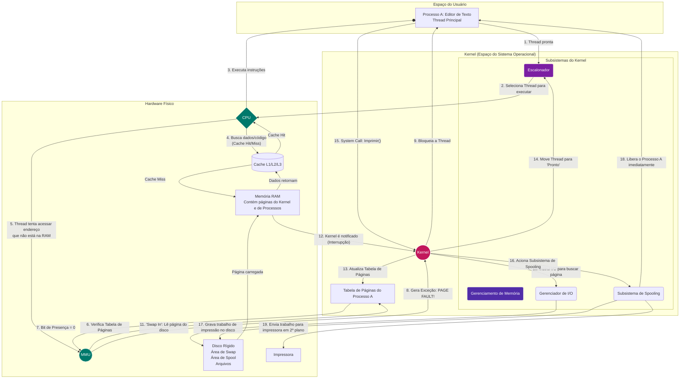

## Guia do Diagrama de Fluxo: Como os Componentes do SO Interagem

Este diagrama ilustra a interdependência funcional dos componentes do SO durante a execução. Siga os números para entender o fluxo.

### Execução Normal (Passos 1-4)

1.  Uma **Thread** do **Processo A** está pronta para executar e entra na fila do **Escalonador**.
2.  O **Escalonador** do **Kernel** seleciona esta thread para usar a **CPU**.
3.  A **CPU** começa a executar as instruções da thread.
4.  Para cada instrução, a **CPU** precisa de dados ou código. Ela primeiro busca na **Cache**. Se encontrar (*Cache Hit*), o acesso é instantâneo. Se não (*Cache Miss*), ela busca na **RAM**, e o dado é copiado para a cache para usos futuros.

### Cenário de *Page Fault* (Passos 5-14)

Aqui, a thread tenta acessar uma parte do programa que não está na memória principal (foi movida para a área de *swap* no disco anteriormente pelo **Gerenciamento de Memória**).

5.  A **CPU**, ao executar a instrução, envia o endereço de memória virtual para a **MMU** (Unidade de Gerenciamento de Memória).
6.  A **MMU** consulta a **Tabela de Páginas** daquele processo, que é controlada pelo Kernel.
7.  A tabela informa que a página não está presente na RAM (o "bit de presença" está desativado).
8.  A **MMU** não consegue traduzir o endereço e dispara uma exceção de hardware: um **Page Fault**, passando o controle à força para o **Kernel**.
9.  O Kernel assume. Sua primeira ação é instruir o **Escalonador** a bloquear a thread que causou a falha, para que ela não consuma mais CPU.
10. O Kernel então comanda o **Gerenciador de I/O** para buscar a página necessária no disco.
11. O Gerenciador de I/O realiza a operação de *Swap In*, lendo a página da "Área de Swap" do **Disco Rígido**.
12. Assim que a página é carregada em um quadro livre na **RAM**, o controlador de disco envia uma interrupção de hardware para a CPU, notificando o **Kernel** que a operação terminou.
13. O Kernel atualiza a **Tabela de Páginas** do processo, apontando para a localização da página agora na RAM e marcando-a como "presente".
14. Finalmente, o Kernel move a thread do estado "bloqueada" de volta para a fila de "prontos", para que o **Escalonador** possa selecioná-la novamente para execução no futuro. A instrução que causou a falha será então re-executada, desta vez com sucesso.

### Cenário de Impressão com *Spooling* (Passos 15-19)

A thread, agora em execução novamente, recebe um comando para imprimir.

15. A thread faz uma chamada de sistema (*system call*) ao **Kernel**, solicitando a impressão.
16. O Kernel, sabendo que a impressora é lenta, não bloqueia o processo. Em vez disso, ele passa os dados para o **Subsistema de Spooling**.
17. O Spooling escreve rapidamente todos os dados a serem impressos em uma área de "Spool" no **Disco Rígido**. Essa operação é rápida porque usa **Buffers** de I/O de disco.
18. Assim que a gravação no disco termina, o Kernel retorna da chamada de sistema, liberando o **Processo A** para continuar seu trabalho. Do ponto de vista do usuário, a impressão foi "instantânea".
19. Em segundo plano, um processo de sistema (o *spooler*), com suas próprias threads e gerenciado pelo **Escalonador**, lê os dados da área de spool no disco e os envia lentamente para a **Impressora**, sem impactar a performance do processo original.
